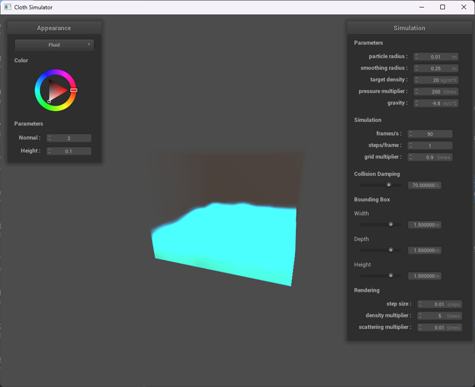

# Fluid Simulation and Rendering

## Team Members

- Arhaan Aggarwal
- Riley Udagawa
- Mateus Ikezaki
- Sirawich Smitsomboon

## Links
Webpage: TODO
[Google Slides](https://docs.google.com/presentation/d/1_BGKCo_NkdHPZXHpAopVWwRYvI28-YdO2QTSNaZbnP4/edit?usp=sharing) 
Video: TODO 

## Abstract

Our project focuses on simulating and rendering realistic fluid behavior in a 3D environment. We implemented a particle based simulation that mimics fluid dynamics through inter particle interactions and boundary collisions. We paired this simulation with a rendering pipeline using volumetric ray marching to visualize the fluid with physics inspired effects like reflection and refraction. The goal is to create an interactive and visually compelling demonstration of fluid behavior, which allows for real time parameter tuning via a GUI.

## Technical Approach

We split the project into two major components:

### 1. Physics Simulation
- Modeled fluids using a particle-based approach (similar to SPH, but simplified).
- Implemented basic inter particle forces based on fluid density and viscosity forces.
- Implemented spatial map techniques  similar to ones in HW 4 to avoid O(n2) runtime in density and particle forces calculation, but with a more careful approach on handling boundaries between each grid.
- Speed up the simulation via parallelism with OpenMP.
- Enabled real time parameter manipulation through a GUI (e.g., tuning target density, pressure multiplier, bounding boxes).

### 2. Rendering
- Initially rendered particles as spheres, then transitioned to ray marching to visualize the fluid volume based on particle density fields.
- Populated a density field based on particles’ positions and converted the density field to a 3D sampler. 
- Marched a ray through the fluid box and accumulated densities (using the sampler) along the way, simulating light scattering.
- Constructed test scenes to evaluate the interaction of light with the fluid body.

## Implementation Details

Our simulation was inspired by YouTube videos from Sebastian Lague (linked in References) and Smoothed Particle Hydrodynamics (SPH) principles. We implemented the following key components:

1. **Smoothing Kernel Functions:** We used a cubic polynomial variant of the Poly6 kernel for density estimation. This ensures a smooth influence falloff from neighboring particles, and a continuous density field. The kernel's derivative is used for calculating pressure gradients between particles.

2. **Pressure Force Calculation:** Pressure forces between particles were derived using a symmetrized formula. We ensured numerical stability by generating a fallback direction (randDirection()) if the distance between particles was zero.

3. **Spatial Hashing:** To avoid brute-force neighbor searches (O(n²)), we implemented a spatial hash grid. Each particle is assigned to a cell in the grid based on its predicted position.

4. **Parallelization:** Most core simulation steps are parallelized using OpenMP. This was important to achieve real time interactivity in our system, especially during the GUI based tuning.
    - Density estimation
    - Pressure force computation
    - Velocity and position updates

## Challenges and Solutions

1. **Performance Bottlenecks:** We noticed performance degradation beyond 1500 particles. We addressed this with spatial partitioning techniques, parallelization with OpenMP, and reducing the step size to ensure that simulation can be run in real-time.

2. **Rendering Complexity:** Although our original plan was to simulate reflection and refraction, we were unable to do so in the time constraints we had. Our primary focus went into ensuring that we had a base shader that blended the particles together in a realistic manner. Implementing that was also challenging, as there was a fine balance between over blurring the particles, and blurring too little. We had to balance the blur intensity along with the number of particles used to simulate the fluid.

3. **Debugging and Parameter Tuning:** Particles sometimes do not behave as expected. A lot of parameter tuning and debugging are required to ensure that the physics of the fluid turned out to look reasonable.

## Lessons Learned

1. Fluid simulation demands a careful balance between performance and realism. Even small changes to force functions drastically affected visual outcomes.

2. Fluid Physics simulations are powerful but require thoughtful parameter tuning to look compelling.

3. Real time interactivity (via GUI) helped improve the debugging, parameter turning, and exploration process.

4. And other than that, we gained experiences working with shaders, physics simulation, and parallelism.

## Results

1. Achieved real-time fluid simulation up to ~3000 particles with stable performance.

2. Developed a functional GUI for manipulating fluid properties.

3. Presented a cohesive and compelling visualization in the final video.

<iframe src="https://drive.google.com/file/d/1EIb4jCAHyiQfdsDxqreK4osjhkFlDHpY/preview" width="640" height="480" allow="autoplay"></iframe>

## References
- [Coding Adventure: Simulating Fluids](https://www.youtube.com/watch?v=rSKMYc1CQHE)
- [Coding Adventure: Rendering Fluids](https://www.youtube.com/watch?v=kOkfC5fLfgE)
- Müller, M., et al. (2003). "Particle-based fluid simulation for interactive applications." ACM SIGGRAPH.
- Bridson, R. (2015). Fluid Simulation for Computer Graphics.

