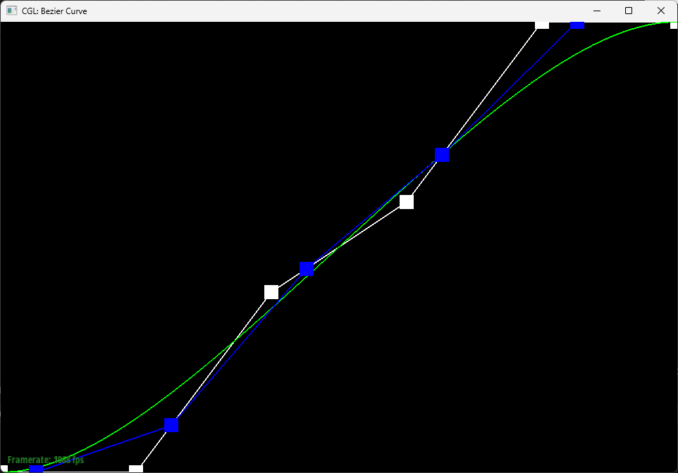
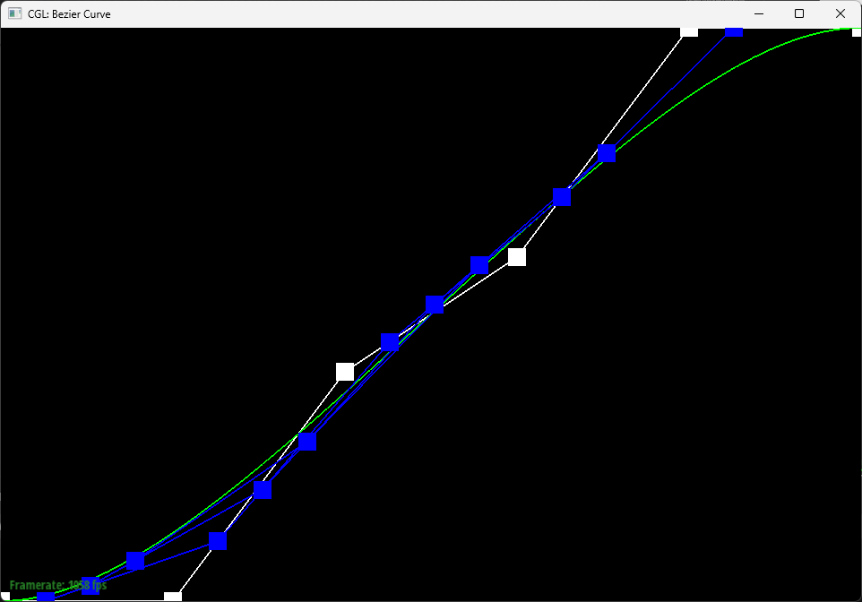
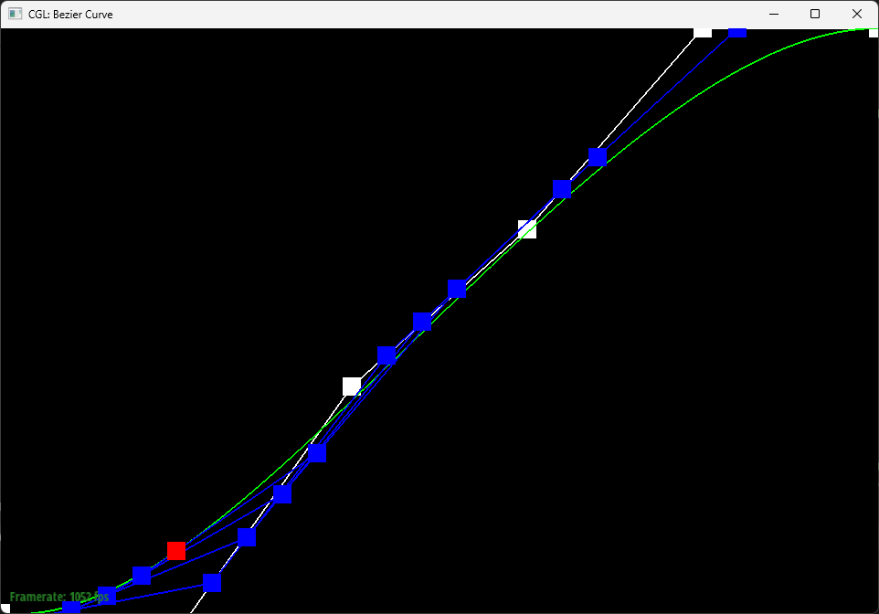
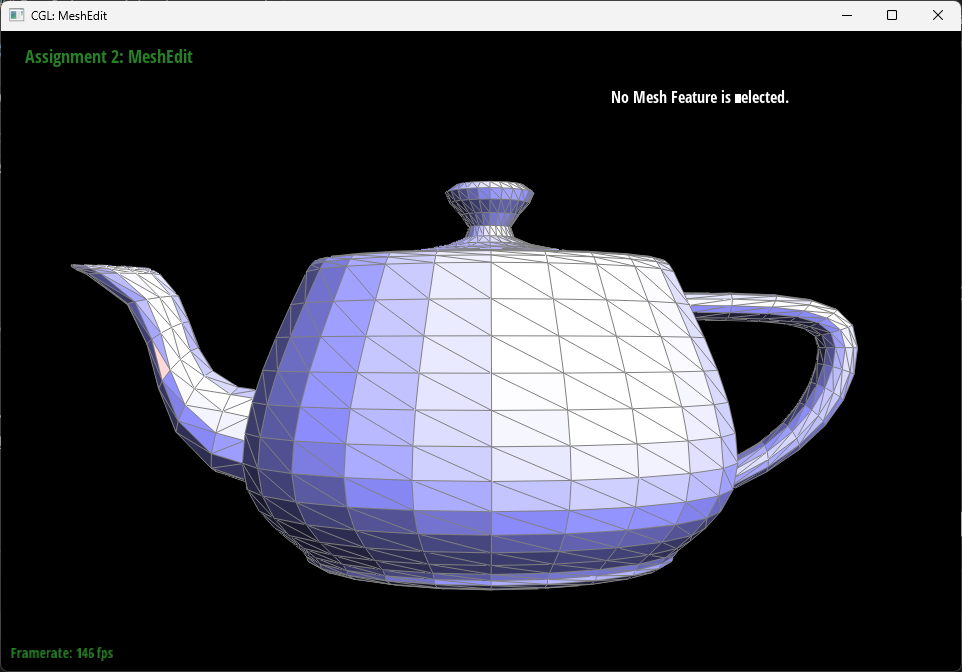
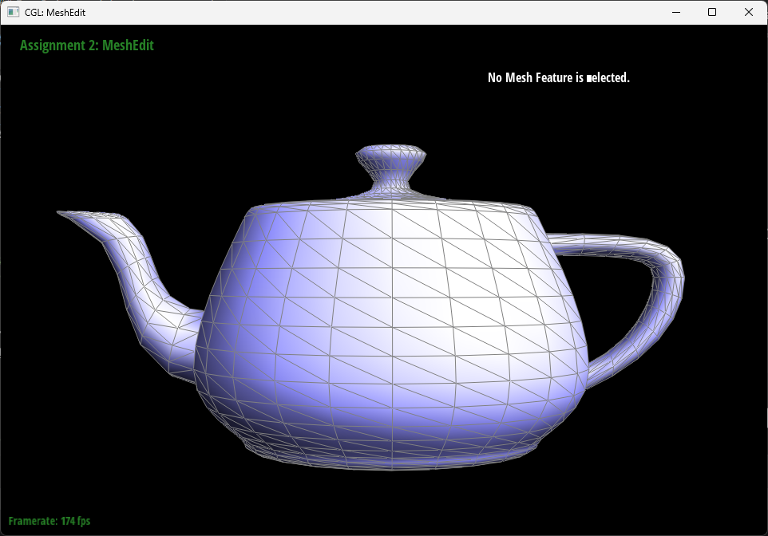
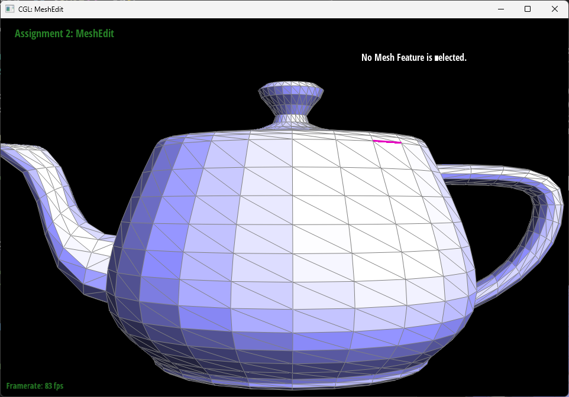
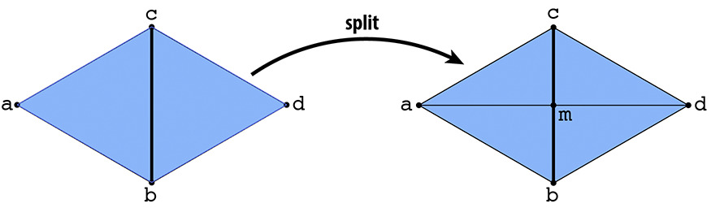
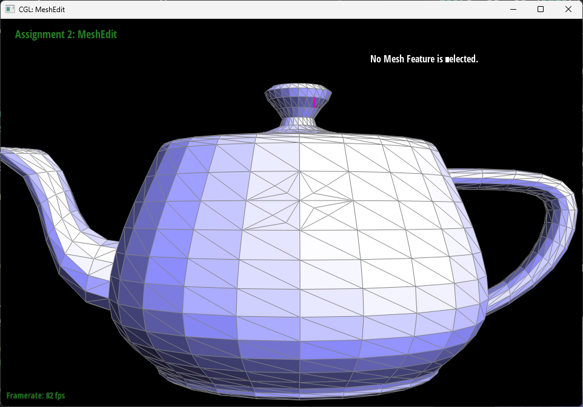
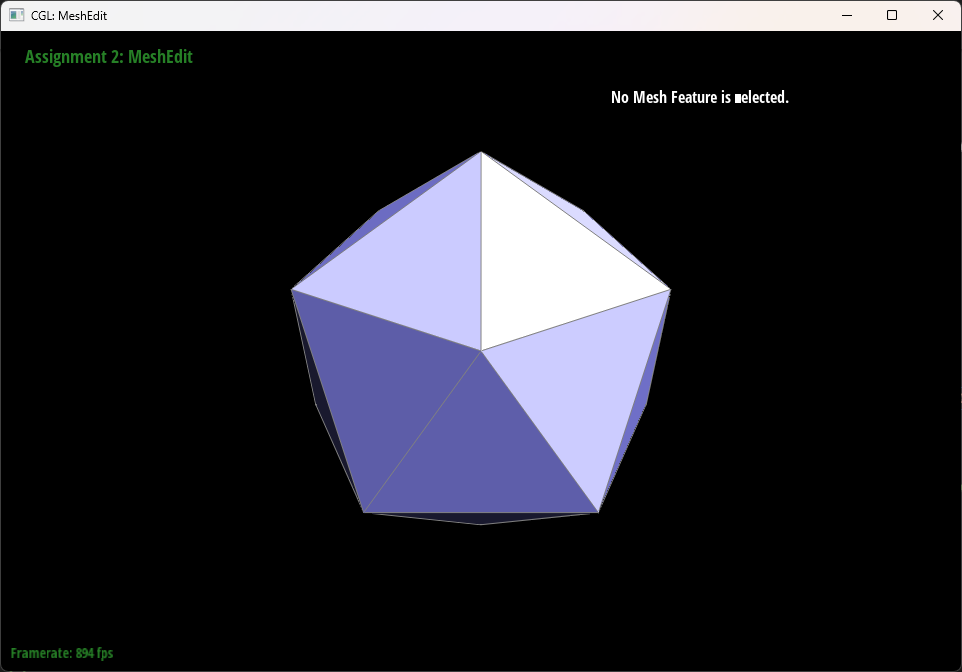
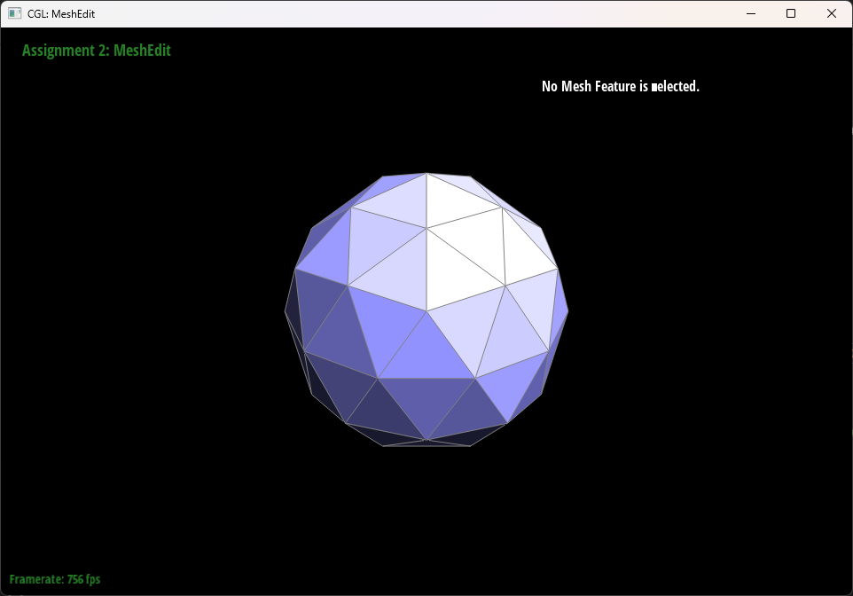

# CS184/284A Spring 2025 Homework 2 Write-Up
<div style="text-align: center;">Sirawich Smitsomboon</div>

Link to webpage: (TODO) [cs184.eecs.berkeley.edu/sp25](https://cs184.eecs.berkeley.edu/sp25)

Link to GitHub repository: [github.com/cal-cs184-student/sp25-hw2-team-of-1](https://github.com/cal-cs184-student/sp25-hw2-team-of-1)

## Overview

<!-- Give a high-level overview of what you implemented in this homework. Think about what you've built as a whole. Share your thoughts on what interesting things you've learned from completing the homework. -->

In this homework, I've built the method to evaluate Bezier Curves and Surfaces at a given `t` using De Casteljau's algorithm and built the system to flip/split edges and do a loop subdivision.

## Section I: Bezier Curves and Surfaces

### Part 1: Bezier curves with 1D de Casteljau subdivision
<!-- Briefly explain de Casteljau’s algorithm and how you implemented it in order to evaluate Bezier curves. -->
De Casteljau's algorithm is the algorithm that runs linear interpolation (lerp) multiple times based on the amount of control points. For each step, I create a new  `std::vector<Vector2D>`, iterate through the points, do linear interpolation, and push the new point into the new vector. The resulting vector has one less element than input `points`.

<!-- Take a look at the provided .bzc files and create your own Bezier curve with 6 control points of your choosing. Use this Bezier curve for your screenshots below. -->
Here's the Bezier curve with 6 control points.


<!-- Show screenshots of each step / level of the evaluation from the original control points down to the final evaluated point. Press E to step through. Toggle C to show the completed Bezier curve as well. -->
Here's each step of evaluation
| Step 1                    | Step 2                    | Step 3                    |
| ------------------------- | ------------------------- | ------------------------- |
|  |  |  |

| Step 4                    | Step 5                    | Step 6                    |
| ------------------------- | ------------------------- | ------------------------- |
|  |  |  |

<!-- Show a screenshot of a slightly different Bezier curve by moving the original control points around and modifying the parameter `t` via mouse scrolling. -->

Here's a slightly different curve with different parameter t.
| t < 0.5                   | t ≈ 0.5                   | t > 0.5                   |
| ------------------------- | ------------------------- | ------------------------- |
|  |  |  |

### Part 2: Bezier surfaces with separable 1D de Casteljau

<!-- Briefly explain how de Casteljau algorithm extends to Bezier surfaces and how you implemented it in order to evaluate Bezier surfaces. -->
De Casteljau's algorithm extends to Bezier surfaces by evaluating the curve on one axis with one parameter, then, treat the evaluated points on that first axis as a Bezier curve, and evalulate points with another parameter.
```cpp
Vector3D evaluate(double u, double v)
{
    // std::vector<std::vector<Vector3D>> controlPoints
	auto pts = std::vector<Vector3D>();

    // Evaluate on one direction with parameter u
	for (int i = 0; i < controlPoints.size(); i++) {
		pts.push_back(evaluate1D(controlPoints[i], u));
	}

    // Then evalulate the collected points on another axis with parameter v
	return evaluate1D(pts, v);
}
```
<!-- Show a screenshot of bez/teapot.bez (not .dae) evaluated by your implementation. -->
Here's the evaluated `bez/teapot.bez`.


## Section II: Triangle Meshes and Half-Edge Data Structure

### Part 3: Area-weighted vertex normals


<!-- Briefly explain how you implemented the area-weighted vertex normals. -->

To implement area-weighted vertex normals, I iterated through all faces, add them times the relative area to the sum, and then call `.unit()` on it to get a unit vector.

To iterate over the faces over the vertex, I get the initial `iter = start = halfedge()` I used `iter->face()` to get the current face and `iter->twin()->next()` to move to the next face. Iterate this using a do-while loop while `iter != start`.

To compute the relative area, gather two vectors representing two of the sides, compute the cross product, and gets its magnitude. This represents double the actual area.
```cpp
auto v1 = he->next()->vertex()->position - he->vertex()->position;
auto v2 = he->next()->next()->vertex()->position - he->next()->vertex()->position;
auto prod = cross(v1, v2);
auto relativearea = sqrt(prod.x * prod.x + prod.y * prod.y + prod.z * prod.z);
```


<!-- Show screenshots of dae/teapot.dae (not .bez) comparing teapot shading with and without vertex normals. Use Q to toggle default flat shading and Phong shading. -->
| Flat shading             | Phong shading            |
| ------------------------ | ------------------------ |
|  |  |


### Part 4: Edge flip

<!-- Briefly explain how you implemented the edge flip operation and describe any interesting implementation / debugging tricks you have used. -->
I have implemented this by referencing the image given in the homework. 


I gathered all the halfedges in this structure. The function takes in the edge CB. First, gets its halfedge, and this halfedge is called `bc`. Then, iterate through all halfedges `next`s and `twin`s and gets all the relevant halfedges, edges, vertexes, faces.
```cpp
VertexIter a, b, c, d; HalfedgeIter ab, bd, dc, ca;
HalfedgeIter _cb, _bc = e0->halfedge();
FaceIter _abc, _bcd;
EdgeIter ab_ba, bd_db, dc_cd, ca_ac;
// Starting with _bc, pattern match with the image on the homework website and assign these
// b, ca, c, ab, a , _cb, c, bd, dc, d, _abc, _bcd, ab_ba, bd_db, dc_cd, ca_ac
```

Then, since the edges will be flipped, the old edge can actually be reused such that no elements will be created or destroyed.
```cpp
// Reuse old `bc` and `cb` halfedges as `ad` and `da` edges.
HalfedgeIter ad = _bc, da = _cb;
// and its associated
EdgeIter ad_da = e0;
```
Then, referencing the diagram again, I set the associated vertexes, halfedges, edges, and faces to match the new target shape.
```cpp
set(a, ab, ab_ba, abd, ab->twin(), bd);
set(b, bd, bd_db, abd, bd->twin(), da);
set(d, da, ad_da, abd, ad,         ab);
set(a, ad, ad_da, acd, da,         dc);
set(d, dc, dc_cd, acd, dc->twin(), ca);
set(c, ca, ca_ac, acd, ca->twin(), ad);
```
where `set` is a helper function
```cpp
static void set(VertexIter src, HalfedgeIter he, EdgeIter e, FaceIter f, HalfedgeIter twin, HalfedgeIter next) {
	src->halfedge() = he;
	e->halfedge() = he;
	f->halfedge() = he;
	twin->twin() = he;
	he->setNeighbors(next, twin, src, e, f);
}
```
<!-- Show screenshots of the teapot before and after some edge flips. -->
| Before edge flips        | After edge flips         |
| ------------------------ | ------------------------ |
|  |  |

<!-- Write about your eventful debugging journey, if you have experienced one. -->
*Debugging Journey: I had the correct implementation before I come up with the simplified `set` helper function, where I set everything one by one. However, Part 6 implementation makes me question whether I implemented Edge flip correctly, so I changed it. Turns out it's the Edge split part that was incorrect, but at this point I went with the simplified `set` helper instead of questionable code that goes back and forth.*

### Part 5: Edge split

<!-- Briefly explain how you implemented the edge split operation and describe any interesting implementation / debugging tricks you have used. -->
I have implemented this by referencing the image given in the homework. 



I gathered all the halfedges in this structure. The function takes in the edge CB. First, gets its halfedge, and this halfedge is called `bc`. Then, iterate through all halfedges `next`s and `twin`s and gets all the relevant halfedges, edges, vertexes, faces.
```cpp
VertexIter a, b, c, d; HalfedgeIter ab, bd, dc, ca;
HalfedgeIter _cb, _bc = e0->halfedge();
FaceIter _abc, _bcd;
EdgeIter ab_ba, bd_db, dc_cd, ca_ac;
// Starting with _bc, pattern match with the image on the homework website and assign these
// b, ca, c, ab, a , _cb, c, bd, dc, d, _abc, _bcd, ab_ba, bd_db, dc_cd, ca_ac
```

Then, I recycled some of the halfedges, edges, faces, but I have to create some more since splitting creates more faces, edges, halfedges, and vertex.
```cpp
// Shrink `cb` and `bc` to `cm` and `mc`.
HalfedgeIter cm = _cb, mc = _bc;
cm_mc = _cb->edge();
// Recycle `abc` and `bcd` for two of the faces.
FaceIter cam = _abc, dcm = _bcd;
// Creates new for the rest
// HalfedgeIter am, ma, bm, mb, dm, md
// EdgeIter bm_mb, am_ma, dm_md
// FaceIter abm, bdm
```
Then, referencing the diagram again, I set the associated vertexes, halfedges, edges, and faces to match the new target shape.
```cpp
set(a, ab, ab->edge(), abm, ab->twin(), bm);
set(b, bm, bm_mb     , abm, mb        , ma);
set(m, ma, am_ma     , abm, am        , ab);
set(b, bd, bd->edge(), bdm, bd->twin(), dm);
set(d, dm, dm_md     , bdm, md        , mb);
set(m, mb, bm_mb     , bdm, bm        , bd);
set(d, dc, dc->edge(), dcm, dc->twin(), cm);
set(c, cm, cm_mc     , dcm, mc        , md);
set(m, md, dm_md     , dcm, dm        , dc);
set(c, ca, ca->edge(), cam, ca->twin(), am);
set(a, am, am_ma     , cam, ma        , mc);
set(m, mc, cm_mc     , cam, cm        , ca);
```
where `set` is the same helper function as last part.
```cpp
static void set(VertexIter src, HalfedgeIter he, EdgeIter e, FaceIter f, HalfedgeIter twin, HalfedgeIter next) {
	src->halfedge() = he;
	e->halfedge() = he;
	f->halfedge() = he;
	twin->twin() = he;
	he->setNeighbors(next, twin, src, e, f);
}
```


<!-- Show screenshots of a mesh before and after some edge splits. -->
| Before edge splits       | After edge splits        |
| ------------------------ | ------------------------ |
|  |  |

<!-- Show screenshots of a mesh before and after a combination of both edge splits and edge flips. -->

| Before edge splits and flips | After edgeedge splits and flips |
| ---------------------------- | ------------------------------- |
|      |         |

<!-- Write about your eventful debugging journey, if you have experienced one. -->
*Debugging Journey: At first, I was not using `set` helper function and was setting edges, faces, halfedges `next()` and `twin()` directly. While working on part 6, it proves that while it seems to work on a small scale, it creates holes when done in a bigger scale. At that time, I spend time to create this `set` helper, which makes it very hard miss setting some attributes.*

### Part 6: Loop subdivision for mesh upsampling


<!-- Briefly explain how you implemented the loop subdivision and describe any interesting implementation / debugging tricks you have used. -->
To implement loop subdivision, I first loop over all vertices, resetting `isNew` flag to false, and calculate their new position and stored in `newPosition`. This calculation loops over all neighbors, take note of the degree of the vertex and the sum of positions, and use the provided formula in the homework website.

Then, I loop over all edges, resetting `isNew` flag to false, and calculate their new midpoint position and stored in `newPosition`. This calculation uses similar pattern matching style implemented in Part 4 and Part 5 to figure out all vertices.
```cpp
HalfEdgeIter ab = center->halfedge();
// starting from HalfEdgeIter ab, get these information via pointer manipulation
// HalfEdgeIter bd, ba, cb
// VertexIter a, b, c, d;
```

Then, use new position of a, b, c, and d (calculated in the first loop over all vertices), calculate the position using the provided formula in the homework website.

Then, split all the original edges. In the spliting logic, also assign isNew flag for these lines, which will be helpful to determine which edges to flip.
```cpp
am_ma->isNew = true;
dm_md->isNew = true;
m->isNew = true;
```

Then, flip the new edges which connects one old vertex and one new vertex (`he->vertex()->isNew != he->next()->vertex()->isNew`).

Here's the result of applying loop subdivision to `icosahedron/input.dae`.

| Original                  | Ater 1 Loop Subdivision   | Ater 2 Loop Subdivisions  |
| ------------------------- | ------------------------- | ------------------------- |
|  |  |  |

After each loop subdivision, the sharp corners becomes more rounded and the mesh seems to become smaller. By pre-spliting some edges, it seems like it does not really change the roundness nor changing the rate which the shape becomes smaller, although do change the balance and how edge splits look like.

<!--
Load dae/cube.dae. Perform several iterations of loop subdivision on the cube. Notice that the cube becomes slightly asymmetric after repeated subdivisions. Can you pre-process the cube with edge flips and splits so that the cube subdivides symmetrically? Document these effects and explain why they occur. Also explain how your pre-processing helps alleviate the effects. -->

As shown in the homework website, the result of performing loop subdivision on the original cube is not symmetrical. This is because the way the edges are laid out is not symmetrical. There is a way to preprocess it such that it is symmetrical, by making an `X` cross on every face like so:

| Original Cube             | Preprocessed Cube         |
| ------------------------- | ------------------------- |
|  |  |

Here is the new cube with symmetrical loop subdivision:

| Preprocessed Cube         | Ater 1 Loop Subdivision   | Ater 2 Loop Subdivisions  |
| ------------------------- | ------------------------- | ------------------------- |
|  |  |  |


| Ater 3 Loop Subdivisions  | Ater 4 Loop Subdivisions  | Ater 5 Loop Subdivisions  |
| ------------------------- | ------------------------- | ------------------------- |
|  |  |  |

Preprocessing this way alleviate the effects since the edge lines on the cube is now symmetrical.