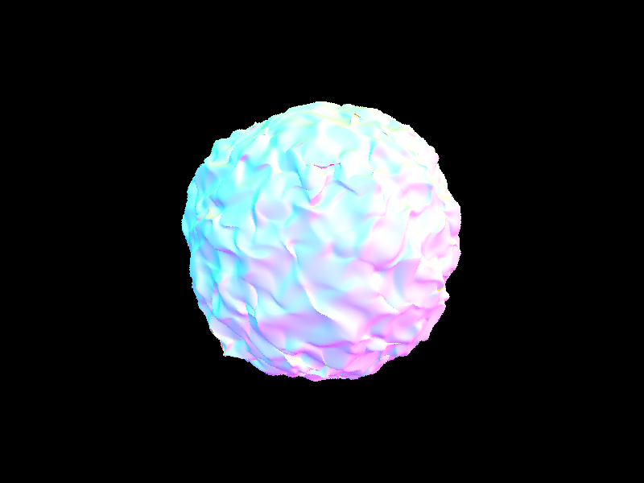
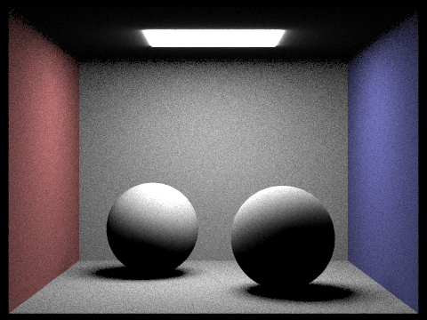

# CS184/284A Spring 2025 Homework 3 Write-Up
<div style="text-align: center;">Sirawich Smitsomboon</div>

Link to webpage: [cal-cs184-student.github.io/hw-webpages-my-team-lol/hw2/index.html](https://cal-cs184-student.github.io/hw-webpages-my-team-lol/hw2/index.html)

Link to GitHub repository: [github.com/cal-cs184-student/sp25-hw2-team-of-1](https://github.com/cal-cs184-student/sp25-hw2-team-of-1)

## Overview

In this homework, we implemented ray generation and intersection and BVH acceleration, which is used to built the ray tracing system and able to render direct lighting and global illumination. Then, we also implemented adaptive sampling, allowing more complex part of the image to be sampled more while keeping the less complex part that easily converge to be sampled less. I learned about the fundamentals of lighting framework from this homework, as I get to actually implement what is presented as an abstract idea in lecture.


## Part 1: Ray Generation and Scene Intersection

### Ray Generation and Primitive Intersection
During the ray tracing, for each (x, y) coordinate, I create `num_samples` rays, each shot into the positon corresponding to the pixel `[x, x+1)`, `[y, y+1)`. To convert from the pixel coordinates, to the image space, I use the coordinate change formula described in lecture


As the result of this matrix multiplication is in the camera space, I left multiplied by `c2w`. Then, normalize the vector to the unit-length vector, and the resulting ray is a ray with its origin at the camera position, and the direction as the unit-length vector computed earlier.

Then, I ensure to set `min_t` and `max_t` to `nClip` and `fClip` as the instruction stated.

### Triangle Intersection Algorithm

First, I need to intersect the ray with the plane normal first. To do so, I compute the normal vector `N` by `(p2 - p1) cross (p3 - p1)`. Then, using the formula given in lecture `t = dot(p1 - r.o, N) / dot(r.d, N)`, then check whether the given value `t` is valid. If the ray does not intersect this plane, then it is considered that the ray did not hit the triangle (since the ray did not hit the plane that the triangle is on).

Secondly, I created the Line Equation Tests function `L`, however, unlike in the lecture slides, I had to adapt the implementation to support 3D spaces and cannot use the final solution directly. Therefore, I implemented according to `L(ptest, p1, p2, NPlane) = V dot N` where `V = ptest - p1` and `N = normal_of(p2 - p1)`, where the normal can be calculated by using `NPlane`: `N = (p2 - p1) cross NPlane`.

Initially, I planned to use the Three Line Tests, but then quickly realized that it is insufficient since I need to compute `isect->n` later. Therefore, I computed the Barycentric Coordinates. Again, unlike in the lecture slide that has a final solution in 2D, I had to step back and use the general form solution:
```cpp
alpha = L(hit_pt, p2, p3, NPlane) / L(p1, p2, p3, NPlane);
beta = L(hit_pt, p1, p3, NPlane) / L(p2, p1, p3, NPlane);
gamma = 1 - alpha - beta;
```

If any components of the barycentric coordinate is negative, then the intersection does not pass the triangle, otherwise, it is. Note that I can make this conclusion because I already check that the intersection point `hit_pt` is in the same plane.

Finally, if all checks passed, fill in the result of the intersection `t` from the plane intersection, bsdf from `get_bsdf()`, `n` from barycentric coordinates interpolation (`n1 * alpha + n2 * beta + n3 * gamma`), and `primitive = this`.

This implementation description is general for `intersect` and `has_intersect`. Implementation-wise, `has_intersect(r)` calls `intersect(r, NULL)` and `intersect` checks that `isect` is not `NULL` before filling in the values.

### Result

Here's a rendering for some of the .dae files:

| CBempty                                              | CBspheres                                                | CBgems                                             |
| ---------------------------------------------------- | -------------------------------------------------------- | -------------------------------------------------- |
|  |  |  |

## Part 2: Bounding Volume Hierarchy

### Implementation

First, I iterate over all elements, getting the bounding box containing all elements and keeping track of all elements count. If the count is less than or equal to `max_leaf_size`, just create a leaf node with the bounding box, setting start and end pointer appropriately.


Otherwise, from this box, I find which spread is the highest (`diff.x`, `diff.y`, or `diff.z`, where diff is `bbox.max - bbox.min`).

Then, I created two new vectors (`left`, `right`) for each case, I iterate over the elements again, checking whether the centroids's x/y/z is less than or equal to `bbox`'s centroid x/y/z. If so, append this to `left`. Otherwise, append this to `right`.

In an event where `left` or `right` have 0 elements (ie. all of them goes to one side), clear the elements, then iterate again from the beginning. The tie-braking rules goes: add left, right, left, right, etc. until the end:
```cpp
bool addleft = true;
for (auto p = start; p != end; p++) {
    if (addleft) {
        left->push_back(*p);
    }
    else {
        right->push_back(*p);
    }
    addleft = !addleft;
}
```
Not the most efficient tie-breaking rule I believe but it works™️. 

### Results

Here are some renderings of normal shading of some large .dae files:
| CBlucy                                             | dragon                                             | blob                                           |
| -------------------------------------------------- | -------------------------------------------------- | ---------------------------------------------- |
|  |  |  |

After rendering a few scences with moderately complex geometries, the render time without BVH acceleration ranges from 20 seconds to a minute, reduced down to 0.1 to 0.2 seconds with BVH acceleration on normal shading. This result was gathered from rendering 800x600 images using 8 threads.

### Generative AI Notice

Per the class policy on Use of Generative-AI tools, I would like to acknowledge some use of Generative AI to assist with debugging. I have implemented all the BVH code and BBox intersection myself first before asking for help as I notice that some things are not quite right when I'm on later tasks.

One change that was implemented in this part is within `BBox::intersect` implementation, where I checked for `t0 < t1` but the Generative AI suggested to change to `t0 <= t1`. This later makes sense to be since if the bounding box is very thin (ie. being very close to being a plane), then `t0` can have such precision that is equal to `t1`.

## Part 3: Direct Illumination

### Implementation

In hemisphere sampling, I loop for `num_samples` times (which is set to `scene->lights.size() * ns_area_light`).

For each iteration, I get a new sample from `hemisphereSampler` to get `wj`, which is then transformed into world space to get the world coordinates `wj = o2w * wj`. Then, create a new ray `Ray(hit_p, wj)` (with `min_t = EPS_F`), find the second intersected object (`i2`). If there isn't an intersection, `incoming_light = (0, 0, 0)`. Otherwise, get the result of the first bounce on `i2` (which simply grabs `i2.bsdf->get_emission()`) and set to `incoming_light`.

Then, I compute the cosine term, which can be derived from `wj` and `isect.n` (`cos = (wj dot isect.n) / (|wj| * |isect.n|)`). If the cosine term is less than 0, then I skip the rest of the logic and move to the next iteration (ie. add 0 light).

Then, I get the reflectance of outgoing direction `wj` and incoming direction `-r.d`. Using the formula in lecture to compute the term inside the summation, `reflectance * incoming_light * cos_theta_j / pdf` where `pdf` is `1/2pi`.

Then, continue to the next iteration.

When the loop finishes, I return `sum / num_samples` completing the rest of the terms in the formula.

In importance sampling, most of the logic is similar. Some differences are that the loop has change from looping `num_samples` time to looping over each light in the scene, and rather than sampling form `hemisphereSampler`, now the sampler uses `light->sample_L`, retriving `wj` and `pdf` (rather than hardcoding the value to `1/2pi`). And in the end, the divider is `scene->lights.size()` rather than `num_samples` on returning `sum / scene->lights.size()`.

### Results

Here are some renderings of hemisphere and importance direct lighting rendering.

| Mode       | CBbunny                                           | CBspheres_lambertian                                                          |
| ---------- | ------------------------------------------------- | ----------------------------------------------------------------------------- |
| Hemisphere |  |  |
| Importance |             |             |

Overall, uniform hemisphere sampling produces noisier outputs than importance lighting sampling.


Additionally, here's the comparison between different light rays

| `-l 1`                         | `-l 4`                         | `-l 16`                          | `-l 64`                          |
| ------------------------------ | ------------------------------ | -------------------------------- | -------------------------------- |
|  |  |  |  |

### Generative AI Notice

Per the class policy on Use of Generative-AI tools, I would like to acknowledge some use of Generative AI to assist with debugging. I have implemented everything in this section myself first before asking for help as I was running into multiple issues.

One of the root cause that makes the rendering gone wrong is the incorrect implementation of `DiffuseBSDF::f`. The correct implementation should not depend on `wo` and `wi`. However, at the time I was confused on how to implement it and didn't implement it right. The Generative AI caught this bug after a lot of pain of going back and forth of other parts. I now understand why the implementation do not require `wo` and `wi` - diffuse transfer function do not depend on the viewing angle. Another part that was helped was that I was confused which two vectors to compute cosine on, as all of them are giving weird results, and sometimes removing `if cos < 0` actually makes things better. After fixing `DiffuseBSDF::f` and accept another suggestion that cosine should be from `wj` and `isect.n`, now I understand that this is how Lambert's cosine works.


## Part 4: Global Illumination

### Implementation

I created a helper function `at_least_one_bounce_radiance_recur(const Ray& r, const Intersection& isect, int recur)` where `at_least_one_bounce_radiance_recur(r, isect)` calls `at_least_one_bounce_radiance_recur(r, isect, 0)`, and adds `zero_bounce_radiance(r, isect)` in appropriate case (if `isAccumBounces` or `max_ray_depth` is 0), to help with keeping track of the depth of the ray.

In the base case implementations, there are some basic (although many) checks, as described by the following psudocode
```python
if recur == 0 and max_ray_depth == 0:
    if currently not in russian roulette mode:
        return Vector3(0, 0, 0)

if recur + 1 >= max_ray_depth:
    if currently in russian roulette mode and coin_flip(0.7):
        continuationprob = 0.7
        # Add one bounce if we are accumulating bounces. Otherwise, don't.
        L = one_bounce_radiance(r, isect) if isAccumBounces else Vector3D(0, 0, 0)
        goto recursive case
    # don't go forward, return the last bounce
    return one_bounce_radiance(r, isect)

continuationprob = 1
# Add one bounce if we are accumulating bounces. Otherwise, don't.
L = one_bounce_radiance(r, isect) if isAccumBounces else Vector3D(0, 0, 0)
goto recursive case
```
`continuationprob` is the probability of continuation, which is later used. Light `L` variable will also be used in the recursive case. If L is one bounce before entering recursive case, it means that one bounce is added to the result of the recursive case.

The logic of the recursive case is similar to the previous part, copied down here, with bold parts representing the differences between the previous part.

**First, we do not loop (ie, only taking one sample) according to the spec.**

**I get a new sample from `isect.bsdf->sample_f(w_out, &wj, &pdf)`, retriving `wj` and `pdf`.** `wj` is then transformed into world space to get the world coordinates `wj = o2w * wj`. Then, create a new ray `newray = Ray(hit_p, wj)` (with `min_t = EPS_F`), find the second intersected object (`i2`). If there isn't an intersection, **return the `L` value retrived earlier**. Otherwise, **do a recursive call to get the incoming light `at_least_one_bounce_radiance_recur(newray, )` get the indirect lighting** and set to `incoming_light`.

Then, I compute the cosine term, which can be derived from `wj` and `isect.n` (`cos = (wj dot isect.n) / (|wj| * |isect.n|)`). If the cosine term is less than 0, **return the `L` value retrived earlier.**.

**With `reflectance` retrived earlier** and using the formula in lecture to compute the term inside the summation, `L_recur = incoming_light * reflectance * cos_theta_j / pdf` where `pdf` is **retrived earlier**.

**Then, return the sum of the new light and the `L` value retrived earlier.**

### Results

Here's some comparison between direct and indirect illumination rendering.

| Direct Illumination                               | Global Indirect Illumination                               |
| ------------------------------------------------- | ---------------------------------------------------------- |
|  |  |

If we cut out the direct illumination from indirect illumination, here is how it looks like:

| Direct Illumination                               | Only Indirect Illumination                                                      | Global Indirect Illumination                        |
| ------------------------------------------------- | ------------------------------------------------------------------------------- | --------------------------------------------------- |
|  |  |  |

Here are some rendering comparing each bounces:

| Bounces       | `-m 0`                                | `-m 1`                                | `-m 2`                                |
| ------------- | ------------------------------------- | ------------------------------------- | ------------------------------------- |
| Unaccumulated |  |  |  |
| Accumulated   |  |  |  |

| Bounces       | `-m 3`                                | `-m 4`                                | `-m 5`                                |
| ------------- | ------------------------------------- | ------------------------------------- | ------------------------------------- |
| Unaccumulated |  |  |  |
| Accumulated   |  |  |  |

In the second bounce of light, it adds the ceiling light and improve the lighting of the front of the bunny. In the third bounce of light, it adds the some shadow more quality of the bunny.


With Russian Roulette, here's the rendering:
| `-m 0`                                       | `-m 1`                                     | `-m 2`                                     |
| -------------------------------------------- | ------------------------------------------ | ------------------------------------------ |
|  |  |  |

| `-m 3`                                     | `-m 4`                                     | `-m 100`                                       |
| ------------------------------------------ | ------------------------------------------ | ---------------------------------------------- |
|  |  |  |

Here are some renders with 4 light rays and varying sample-per-pixel rates.
| `-s 1`                                         | `-s 2`                                         | `-s 4`                                         |
| ---------------------------------------------- | ---------------------------------------------- | ---------------------------------------------- |
|  |  |  |

| `-s 8`                                         | `-s 16`                                          | `-s 64`                                          |
| ---------------------------------------------- | ------------------------------------------------ | ------------------------------------------------ |
|  |  |  |

| `-s 1024`                                            |
| ---------------------------------------------------- |
|  |

### Generative AI Notice

Per the class policy on Use of Generative-AI tools, I would like to acknowledge some use of Generative AI to assist with debugging. While geneative AI was not target to be used specifically for this part, some fixes for Part 3 causes some implementation in Part 4 to be updated as well, as the implementation are similar to each other. Specifically, the fix of the cosine term in Part 3 makes me also update the cosine term implementation in Part 4. As of lessons learned, it is similar to Part 3 Generative AI Notice for cosine term part.

## Part 5: Adaptive Sampling 

Adaptive sampling is a method of sampling different amount based on the rate of convergence. If the pixels seem to converge fast, stop sampling to save time. This allows cranking up the number of samples up to very high to be possible, as some hard parts will take longer to converge, but other easy parts will not ramp up in number of samples as well.

### Implementation

Adaptive sampling is a method of sampling different amount based on the rate of convergence. If the pixels seem to converge fast, stop sampling. In the original `raytrace_pixel` loop, I have added variables to keep track of the `sumil` and `sumilsq`, which are the sum of `out.illum()` and sum of `out.illum() * out.illum()`. Then, if it is every `samplesPerBatch`th sample, then I compute the `I` value according to mean and standard deviation and the num samples so far, based on the formula given in the homework. If `I` is less than `maxTolerance * mean`, then I save the num samples so far by overriding `num_samples` (so that `sampleBuffer.update_pixel(sum / num_samples, x, y)` works as expected) and early exit the loop. Then, ensure to store `num_samples` in `sampleCountBuffer` as well.

### Results

Here are some renderings:

| Type             | `CBbunny`                                                        | `CBspheres_lambertian`                                          |
| ---------------- | ---------------------------------------------------------------- | --------------------------------------------------------------- |
| Output Rendering |         |       |
| Sample Rate      |  |  |