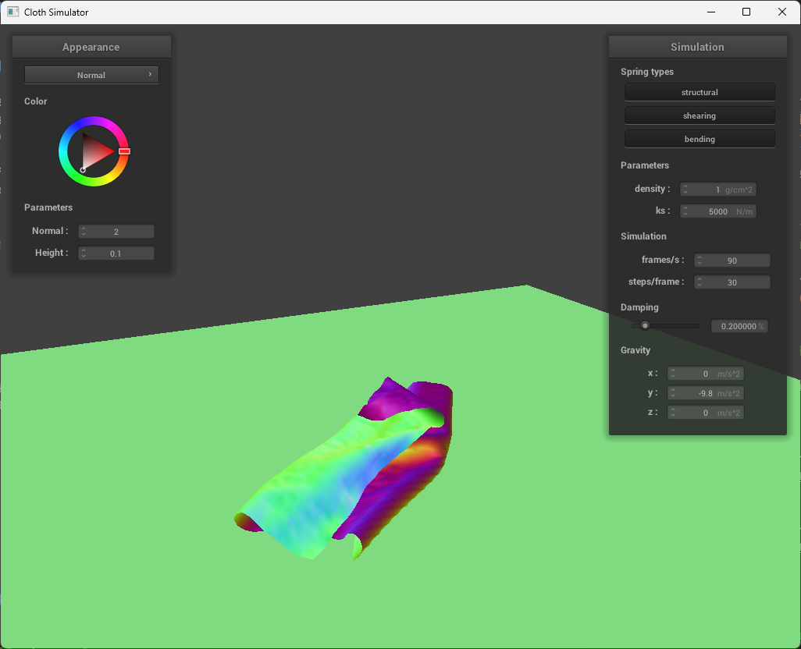

# CS184/284A Spring 2025 Homework 4 Write-Up
<div style="text-align: center;">Sirawich Smitsomboon</div>

Link to webpage: [cal-cs184-student.github.io/hw-webpages-my-team-lol/hw4/index.html](https://cal-cs184-student.github.io/hw-webpages-my-team-lol/hw4/index.html)

Link to GitHub repository: [github.com/cal-cs184-student/sp25-hw4-call-random_string](https://github.com/cal-cs184-student/sp25-hw4-call-random_string)

## Overview

In this homework, I have implemented cloth simulation via Verlet Integration, but in addition to handling forces, I have also handled collisions with objects and self collision with the cloth. And finally, I have decorated the scene via different kinds of shaders rather than delivering the final product only at normal shader and wireframe.

## Part 1: Masses and springs

<!-- Take some screenshots of scene/pinned2.json from a viewing angle where you can clearly see the cloth wireframe to show the structure of your point masses and springs. -->

Here are some screenshots of `scene/pinned2.json`.
|                           |                             |
| ------------------------- | --------------------------- |
|  |  |

<!-- Show us what the wireframe looks like (1) without any shearing constraints, (2) with only shearing constraints, and (3) with all constraints. -->
| Without Shearing                                  | Only Shearing                               | All Constraints                                 |
| ------------------------------------------------- | ------------------------------------------- | ----------------------------------------------- |
|  |  |  |

## Part 2: Simulation via numerical integration

<!-- 1. Experiment with some the parameters in the simulation.

For each one, observe any noticeable differences in the cloth compared to the default parameters and show us some screenshots of those interesting differences and describe when they occur. -->
After experimenting with varying the parameters, here are the results.
<!-- 1.1 Describe the effects of changing the spring constant ks; how does the cloth behave from start to rest with a very low ks? A high ks? -->
### Varying `ks`

Higher `ks` makes the cloth stiffer. In a very low `ks` for pinned2, the cloth have multiple creases. In a very high `ks` for pinned2, the cloth is strected less than at the default `ks` value, making the center path fall very slightly.

| `ks = 100`                 | `ks = 5000`                 | `ks = 15000`                   |
| -------------------------- | --------------------------- | ------------------------------ |
|  |  |  |

<!-- 1.2 What about for density? -->
### Varying density

Increasing the desity makes the cloth heavier. For pinned2, when density is low, it falls less and it can be observed that the spring force is able to pull the cloth sideway a bit more. when density is high, it seems that the horizontal force affects less.

| `density = 1`               | `density = 15`            | `density = 100`                 |
| --------------------------- | ------------------------- | ------------------------------- |
|  |  |  |

<!-- 1.3 What about for damping? -->
### Varying damping

Higher damping results in slower falling. Lower damping results in faster falling, with the higher inertia, making the clothes swing back and forth multiple times before it converges down to a steady state. Higher damping results in very slow falling.

| `damping ≈ 0.046%`                   | `damping = 0.20%`            | `damping ≈ 0.862%`                   |
| ------------------------------------ | ---------------------------- | ------------------------------------ |
|  |  |  |

While the final result of 0.862% does not look different, the time it takes for the cloth to fall down is significantly higher.

"Swinging" during `damping ≈ 0.046%` simulation


<!-- 2. Show us a screenshot of your shaded cloth from scene/pinned4.json in its final resting state! If you choose to use different parameters than the default ones, please list them. -->
Here's the final resting state of pinned4:


## Part 3: Handling collisions with other objects

<!-- Describe your implementation of handling collisions with spheres and planes. -->
### Sphere Collision

If the point is inside the sphere (distance between point mass and sphere_center is less than radius), then the point mass position is modified by the following method:

1. Tangent point is calculated as the point "bumped" up to the sphere boundary (Offset the origin by `radius` length in the direction of the new point mass)
2. Correction vector is the vector from the point mass last position to the tangent point.
3. The current point mass position is modified to be `pm.last_position + correction_vector * (1 - friction)`.

### Plane Collision

Unlike the sphere collision, we cannot really check if the point is "inside" the plane as it is very thin. Therefore, the method to "check" is to use ray-plane intersection concept from lecture by making a ray of the last position pointing in the direction of the current position. If the plane is parallel (`d dot normal == 0`), then it is moving parallel to the plane (not clipped through). If `t < 0`, then there is no collision. (moving away from plane) If `t > (pm.position - pm.last_position).norm()`, then there is no collision (the point pass has moved towards the plane but does not collide with the plane yet). Otherwise, there exists a collision, and the point mass position is modified by the following method:

1. Tangent point is calculated as the point "bumped" up to the plane boundary (the intersection point between the plane and the ray, bumped up by `SURFACE_OFFSET` as instructed by the spec) ()
2. Correction vector is the vector from the point mass last position to the tangent point.
3. The current point mass position is modified to be `pm.last_position + correction_vector * (1 - friction)`.

### Results

<!-- Show us screenshots of your shaded cloth from scene/sphere.json in its final resting state on the sphere using the default ks = 5000 as well as with ks = 500 and ks = 50000. Describe the differences in the results. -->
| `ks = 500`                | `ks = 5000`                | `ks = 50000`                  |
| ------------------------- | -------------------------- | ----------------------------- |
|  |  |  |

The lower `ks` value results in the cloth being able to stretch more. The higher `ks` value reduces that effect, and even higher would result in the cloth able to maintain its shape in a specific form.

<!-- Show us a screenshot of your shaded cloth lying peacefully at rest on the plane. If you haven’t by now, feel free to express your colorful creativity with the cloth! (You will need to complete the shaders portion first to show custom colors.) -->

And here's the cloth <i>peacefully</i> lying at rest on the plane.


## Part 4: Handling self-collisions

<!-- Describe your implementation of handling self-collisions. -->
Implementation:
1. Build Spatial Map
2. For each point mass, if it is not pinned, check for self collision and adjust its position.

### Building Sptail Map

After clearing the hashmap, the points are used to build a hashmap, with its hash as a key, and a vector of point masses as its value. Hashing the point mass is done via its position via the following heuristics:

```python
w = 3 * width / num_width_points
h = 3 * height / num_height_points
t = max(w, h)
x = floor(pos.x / w)
y = floor(pos.y / h)
z = floor(pos.z / t)
output_hash = x + y + z
```

### Self collision check and adjustment

Retrive the vector of point masses to see the candidate of point masses near the current point mass. For each point mass (that is not itself), calculate the `diff = pm2->position - pm.position` if the `diff`'s length is less than `2 * thickness`, then the adjustment vector is `-diff.unit() * (diff.norm() - 2 * thickness)`. This vector intent is to make the diff will become `2 * thickness`. However, it is not applied yet.

After going through every point mass near the current point mass, take an average of the adjustment vectors, divide by `simulation_steps`, and apply to the current point mass position.

<!-- Show us at least 3 screenshots that document how your cloth falls and folds on itself, starting with an early, initial self-collision and ending with the cloth at a more restful state (even if it is still slightly bouncy on the ground). -->
|                                            |                                     |                                          |
| ------------------------------------------ | ----------------------------------- | ---------------------------------------- |
|  |  |  |


<!-- Vary the density as well as ks and describe with words and screenshots how they affect the behavior of the cloth as it falls on itself. -->

By varying `ks`, the lower `ks` shows the cloth falling down with less area, and have less area per stack (or does not really stack) and easily fall on to the ground. Larger `ks` shows the effect of the stack having the larger area.

| `ks = 100`                       | `ks = 15000`                         |
| -------------------------------- | ------------------------------------ |
|  |  |

By varying density, the lower `ks` shows the cloth falling down with more area and is bent less while falling. Larger `ks` shows falling action dominates and there is less bent, and have less area per stack (or does not really stack) while falling.

| `density = 1`                     | `density = 100`                       |
| --------------------------------- | ------------------------------------- |
|  |  |


## Part 5: Shaders

<!-- Explain in your own words what is a shader program and how vertex and fragment shaders work together to create lighting and material effects. -->
Shader program is a program that is compiled and usually run under parallelism (such as GPU acceleration). Vertex shader provides the information of the vertex and apply transformations and modify geometric properties. Fragment shader computes the output color after rasterization. Vertex shader provides information for fragment shader.

<!-- Explain the Blinn-Phong shading model in your own words. Show a screenshot of your Blinn-Phong shader outputting only the ambient component, a screen shot only outputting the diffuse component, a screen shot only outputting the specular component, and one using the entire Blinn-Phong model. -->
Blinn-Phong shading model have multiple components. Ambient lighting is the light that is applied everywhere. Specular lighting provides the white spot on the shape from where the light comes from. And diffuse shading provides the base reflection of light in all directions.

| Ambient                        | Diffuse                        | Specular                         |
| ------------------------------ | ------------------------------ | -------------------------------- |
|  |  |  |

<!-- Show a screenshot of your texture mapping shader using your own custom texture by modifying the textures in /textures/. -->
Here's a screenshot of my texture mapping shader.


<!-- Show a screenshot of bump mapping on the cloth and on the sphere.--> 
Here's the bump mapping on the cloth and on the sphere.

| Cloth                           | Sphere                            | Cloth On Sphere                                     |
| ------------------------------- | --------------------------------- | --------------------------------------------------- |
|  |  |  |


<!-- Show a screenshot of displacement mapping on the sphere. Use the same texture for both renders. You can either provide your own texture or use one of the ones in the textures directory, BUT choose one that’s not the default texture_2.png. Compare the two approaches and resulting renders in your own words. Compare how your the two shaders react to the sphere by changing the sphere mesh’s coarseness by using -o 16 -a 16 and then -o 128 -a 128. -->
Here's some displacement mapping on the sphere:

| Type         | `-o 16 -a 16`                          | `-o 128 -a 128`                          |
| ------------ | -------------------------------------- | ---------------------------------------- |
| Bump         |          |          |
| Displacement |  |  |

There seems to be no significant difference between bumps on both parameters. However, there exists some difference in displacement shading in terms of the object shapes between the parameters. As the resolution increases, the change in displacements seem to decrease in displacement shading.

<!-- Show a screenshot of your mirror shader on the cloth and on the sphere. -->
Here's the mirror shader on sphere and cloth:

| Cloth                             | Sphere                              | Cloth On Sphere                                       |
| --------------------------------- | ----------------------------------- | ----------------------------------------------------- |
|  |  |  |
